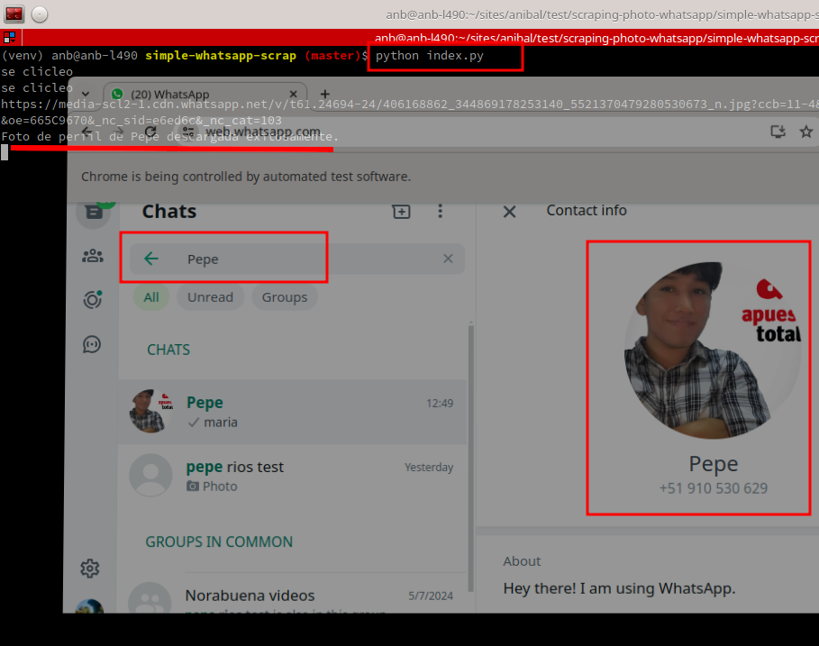

# Simple whatsapp scrap

This is the simple way. You must install one by one

    chromium browser [Install](https://www.chromium.org/getting-involved/download-chromium/)
    python 3.12

# [For Project Maker] : install and config a python project

Create virtual enviroment

    python -m venv venv
    source venv/bin/activate
    # pip freeze > requirements.txt # Optional. usefull command to print the packages used by project

install selenium and requests pip packages

    pip install selenium
    pip install requests

# [For Developer] : Easy get started

    cd <your-project-directory>
    source venv/bin/activate
    pip install -r requirements.txt

Execute the python app on the terminal

    python index.py 

